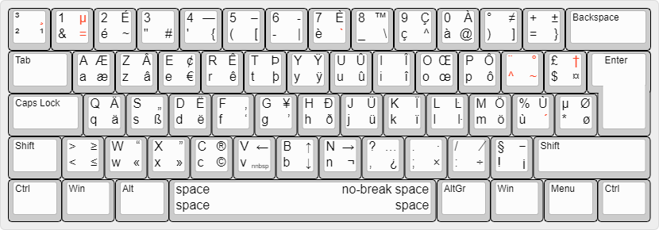

# frlatin9w

French latin9 keyboard layout for Windows

## Build

1. Install [Microsoft Keyboard Layout Creator](https://microsoft-keyboard-layout-creator.software.informer.com/).
2. File > Load Source File... > frlatin9w.klc
3. Project > Build DLL and Setup Package

## Install

1. Run `setup.exe`
2. Start Menu > Settings > Time & language > Language > Français > Options
3. Add `Français - latin9` and delete `Français`

## Layout

#### Main layout



#### Acute


#### Grave


#### Diaeresis


#### Circumflex


#### Cedilla


#### Tilde


#### Ring


#### Mathematics


#### Greek alphabet


#### Misc


Images from [https://github.com/ijprest/keyboard-layout-editor](https://github.com/ijprest/keyboard-layout-editor).

## Characters

#### Main layout

```
U+0020	 	SPACE
U+0021	!	EXCLAMATION MARK
U+0022	"	QUOTATION MARK
U+0023	#	NUMBER SIGN
U+0024	$	DOLLAR SIGN
U+0025	%	PERCENT SIGN
U+0026	&	AMPERSAND
U+0027	'	APOSTROPHE
U+0028	(	LEFT PARENTHESIS
U+0029	)	RIGHT PARENTHESIS
U+002A	*	ASTERISK
U+002B	+	PLUS SIGN
U+002C	,	COMMA
U+002D	-	HYPHEN-MINUS
U+002E	.	FULL STOP
U+002F	/	SOLIDUS
U+0030	0	DIGIT ZERO
U+0031	1	DIGIT ONE
U+0032	2	DIGIT TWO
U+0033	3	DIGIT THREE
U+0034	4	DIGIT FOUR
U+0035	5	DIGIT FIVE
U+0036	6	DIGIT SIX
U+0037	7	DIGIT SEVEN
U+0038	8	DIGIT EIGHT
U+0039	9	DIGIT NINE
U+003A	:	COLON
U+003B	;	SEMICOLON
U+003C	<	LESS-THAN SIGN
U+003D	=	EQUALS SIGN
U+003E	>	GREATER-THAN SIGN
U+003F	?	QUESTION MARK
U+0040	@	COMMERCIAL AT
U+0040	P	LATIN CAPITAL LETTER P
U+0041	A	LATIN CAPITAL LETTER A
U+0042	B	LATIN CAPITAL LETTER B
U+0043	C	LATIN CAPITAL LETTER C
U+0044	D	LATIN CAPITAL LETTER D
U+0045	E	LATIN CAPITAL LETTER E
U+0046	F	LATIN CAPITAL LETTER F
U+0047	G	LATIN CAPITAL LETTER G
U+0048	H	LATIN CAPITAL LETTER H
U+0049	I	LATIN CAPITAL LETTER I
U+004A	J	LATIN CAPITAL LETTER J
U+004B	K	LATIN CAPITAL LETTER K
U+004C	L	LATIN CAPITAL LETTER L
U+004D	M	LATIN CAPITAL LETTER M
U+004E	N	LATIN CAPITAL LETTER N
U+004F	O	LATIN CAPITAL LETTER O
U+0051	Q	LATIN CAPITAL LETTER Q
U+0052	R	LATIN CAPITAL LETTER R
U+0053	S	LATIN CAPITAL LETTER S
U+0054	T	LATIN CAPITAL LETTER T
U+0055	U	LATIN CAPITAL LETTER U
U+0056	V	LATIN CAPITAL LETTER V
U+0057	W	LATIN CAPITAL LETTER W
U+0058	X	LATIN CAPITAL LETTER X
U+0058	Y	LATIN CAPITAL LETTER Y
U+005A	Z	LATIN CAPITAL LETTER Z
U+005B	[	LEFT SQUARE BRACKET
U+005C	\	REVERSE SOLIDUS
U+005D	]	RIGHT SQUARE BRACKET
U+005E	^	CIRCUMFLEX ACCENT
U+005F	_	LOW LINE
U+0060	`	GRAVE ACCENT
U+0061	a	LATIN SMALL LETTER A
U+0062	b	LATIN SMALL LETTER B
U+0063	c	LATIN SMALL LETTER C
U+0064	d	LATIN SMALL LETTER D
U+0065	e	LATIN SMALL LETTER E
U+0066	f	LATIN SMALL LETTER F
U+0067	g	LATIN SMALL LETTER G
U+0068	h	LATIN SMALL LETTER H
U+0069	i	LATIN SMALL LETTER I
U+006A	j	LATIN SMALL LETTER J
U+006B	k	LATIN SMALL LETTER K
U+006C	l	LATIN SMALL LETTER L
U+006D	m	LATIN SMALL LETTER M
U+006E	n	LATIN SMALL LETTER N
U+006F	o	LATIN SMALL LETTER O
U+0070	p	LATIN SMALL LETTER P
U+0071	q	LATIN SMALL LETTER Q
U+0072	r	LATIN SMALL LETTER R
U+0073	s	LATIN SMALL LETTER S
U+0074	t	LATIN SMALL LETTER T
U+0075	u	LATIN SMALL LETTER U
U+0076	v	LATIN SMALL LETTER V
U+0077	w	LATIN SMALL LETTER W
U+0078	x	LATIN SMALL LETTER X
U+0078	y	LATIN SMALL LETTER Y
U+007A	z	LATIN SMALL LETTER Z
U+007B	{	LEFT CURLY BRACKET
U+007C	|	VERTICAL LINE
U+007D	}	RIGHT CURLY BRACKET
U+007E	~	TILDE
U+00A0	 	NO-BREAK SPACE
U+00A1	¡	INVERTED EXCLAMATION MARK
U+00A2	¢	CENT SIGN
U+00A3	£	POUND SIGN
U+00A4	¤	CURRENCY SIGN
U+00A5	¥	YEN SIGN
U+00A7	§	SECTION SIGN
U+00A8	¨	DIAERESIS
U+00A9	©	COPYRIGHT SIGN
U+00AB	«	LEFT-POINTING DOUBLE ANGLE QUOTATION MARK
U+00AC	¬	NOT SIGN
U+00AE	®	REGISTERED SIGN
U+00B0	°	DEGREE SIGN
U+00B1	±	PLUS-MINUS SIGN
U+00B2	²	SUPERSCRIPT TWO
U+00B3	³	SUPERSCRIPT THREE
U+00B4	´	ACUTE ACCENT
U+00B5	µ	MICRO SIGN
U+00B7	·	MIDDLE DOT
U+00B8	¸	CEDILLA
U+00B9	¹	SUPERSCRIPT ONE
U+00BB	»	RIGHT-POINTING DOUBLE ANGLE QUOTATION MARK
U+00BF	¿	INVERTED QUESTION MARK
U+00C0	À	LATIN CAPITAL LETTER A WITH GRAVE
U+00C2	Â	LATIN CAPITAL LETTER A WITH CIRCUMFLEX
U+00C4	Ä	LATIN CAPITAL LETTER A WITH DIAERESIS
U+00C6	Æ	LATIN CAPITAL LETTER AE
U+00C7	Ç	LATIN CAPITAL LETTER C WITH CEDILLA
U+00C8	È	LATIN CAPITAL LETTER E WITH GRAVE
U+00C9	É	LATIN CAPITAL LETTER E WITH ACUTE
U+00CA	Ê	LATIN CAPITAL LETTER E WITH CIRCUMFLEX
U+00CB	Ë	LATIN CAPITAL LETTER E WITH DIAERESIS
U+00CE	Î	LATIN CAPITAL LETTER I WITH CIRCUMFLEX
U+00CF	Ï	LATIN CAPITAL LETTER I WITH DIAERESIS
U+00D0	Ð	LATIN CAPITAL LETTER ETH
U+00D4	Ô	LATIN CAPITAL LETTER O WITH CIRCUMFLEX
U+00D6	Ö	LATIN CAPITAL LETTER O WITH DIAERESIS
U+00D7	×	MULTIPLICATION SIGN
U+00D8	Ø	LATIN CAPITAL LETTER O WITH STROKE
U+00D9	Ù	LATIN CAPITAL LETTER U WITH GRAVE
U+00DB	Û	LATIN CAPITAL LETTER U WITH CIRCUMFLEX
U+00DC	Ü	LATIN CAPITAL LETTER U WITH DIAERESIS
U+00DE	Þ	LATIN CAPITAL LETTER THORN
U+00DF	ß	LATIN SMALL LETTER SHARP S
U+00E0	à	LATIN SMALL LETTER A WITH GRAVE
U+00E2	â	LATIN SMALL LETTER A WITH CIRCUMFLEX
U+00E4	ä	LATIN SMALL LETTER A WITH DIAERESIS
U+00E6	æ	LATIN SMALL LETTER AE
U+00E7	ç	LATIN SMALL LETTER C WITH CEDILLA
U+00E8	è	LATIN SMALL LETTER E WITH GRAVE
U+00E9	é	LATIN SMALL LETTER E WITH ACUTE
U+00EA	ê	LATIN SMALL LETTER E WITH CIRCUMFLEX
U+00EB	ë	LATIN SMALL LETTER E WITH DIAERESIS
U+00EE	î	LATIN SMALL LETTER I WITH CIRCUMFLEX
U+00EF	ï	LATIN SMALL LETTER I WITH DIAERESIS
U+00F0	ð	LATIN SMALL LETTER ETH
U+00F4	ô	LATIN SMALL LETTER O WITH CIRCUMFLEX
U+00F6	ö	LATIN SMALL LETTER O WITH DIAERESIS
U+00F7	÷	DIVISION SIGN
U+00F8	ø	LATIN SMALL LETTER O WITH STROKE
U+00F9	ù	LATIN SMALL LETTER U WITH GRAVE
U+00FB	û	LATIN SMALL LETTER U WITH CIRCUMFLEX
U+00FC	ü	LATIN SMALL LETTER U WITH DIAERESIS
U+00FE	þ	LATIN SMALL LETTER THORN
U+00FF	ÿ	LATIN SMALL LETTER Y WITH DIAERESIS
U+013F	Ŀ	LATIN CAPITAL LETTER L WITH MIDDLE DOT
U+0140	ŀ	LATIN SMALL LETTER L WITH MIDDLE DOT
U+0152	Œ	LATIN CAPITAL LIGATURE OE
U+0153	œ	LATIN SMALL LIGATURE OE
U+0178	Ÿ	LATIN CAPITAL LETTER Y WITH DIAERESIS
U+03BC	μ	GREEK SMALL LETTER MU
U+2011	‑	NON-BREAKING HYPHEN
U+2013	–	EN DASH
U+2014	—	EM DASH
U+2018	‘	LEFT SINGLE QUOTATION MARK
U+2019	’	RIGHT SINGLE QUOTATION MARK
U+201A	‚	SINGLE LOW-9 QUOTATION MARK
U+201C	“	LEFT DOUBLE QUOTATION MARK
U+201D	”	RIGHT DOUBLE QUOTATION MARK
U+201E	„	DOUBLE LOW-9 QUOTATION MARK
U+2020	†	DAGGER
U+2026	…	HORIZONTAL ELLIPSIS
U+202F	 	NARROW NO-BREAK SPACE
U+20AC	€	EURO SIGN
U+2122	™	TRADE MARK SIGN
U+2190	←	LEFTWARDS ARROW
U+2191	↑	UPWARDS ARROW
U+2192	→	RIGHTWARDS ARROW
U+2193	↓	DOWNWARDS ARROW
U+2212	−	MINUS SIGN
U+2215	∕	DIVISION SLASH
U+2260	≠	NOT EQUAL TO
U+2264	≤	LESS-THAN OR EQUAL TO
U+2265	≥	GREATER-THAN OR EQUAL TO
```

#### Acute

```
U+00B4	´	ACUTE ACCENT
U+00C1	Á	LATIN CAPITAL LETTER A WITH ACUTE
U+00C9	É	LATIN CAPITAL LETTER E WITH ACUTE
U+00CD	Í	LATIN CAPITAL LETTER I WITH ACUTE
U+00D3	Ó	LATIN CAPITAL LETTER O WITH ACUTE
U+00DA	Ú	LATIN CAPITAL LETTER U WITH ACUTE
U+00DD	Ý	LATIN CAPITAL LETTER Y WITH ACUTE
U+00E1	á	LATIN SMALL LETTER A WITH ACUTE
U+00E9	é	LATIN SMALL LETTER E WITH ACUTE
U+00ED	í	LATIN SMALL LETTER I WITH ACUTE
U+00F3	ó	LATIN SMALL LETTER O WITH ACUTE
U+00FA	ú	LATIN SMALL LETTER U WITH ACUTE
U+00FD	ý	LATIN SMALL LETTER Y WITH ACUTE
U+0106	Ć	LATIN CAPITAL LETTER C WITH ACUTE
U+0107	ć	LATIN SMALL LETTER C WITH ACUTE
U+0139	Ĺ	LATIN CAPITAL LETTER L WITH ACUTE
U+013A	ĺ	LATIN SMALL LETTER L WITH ACUTE
U+0143	Ń	LATIN CAPITAL LETTER N WITH ACUTE
U+0144	ń	LATIN SMALL LETTER N WITH ACUTE
U+0154	Ŕ	LATIN CAPITAL LETTER R WITH ACUTE
U+0155	ŕ	LATIN SMALL LETTER R WITH ACUTE
U+015A	Ś	LATIN CAPITAL LETTER S WITH ACUTE
U+015B	ś	LATIN SMALL LETTER S WITH ACUTE
U+0179	Ź	LATIN CAPITAL LETTER Z WITH ACUTE
U+017A	ź	LATIN SMALL LETTER Z WITH ACUTE
U+01F4	Ǵ	LATIN CAPITAL LETTER G WITH ACUTE
U+01F5	ǵ	LATIN SMALL LETTER G WITH ACUTE
U+01FC	Ǽ	LATIN CAPITAL LETTER AE WITH ACUTE
U+01FD	ǽ	LATIN SMALL LETTER AE WITH ACUTE
U+1E08	Ḉ	LATIN CAPITAL LETTER C WITH CEDILLA AND ACUTE
U+1E09	ḉ	LATIN SMALL LETTER C WITH CEDILLA AND ACUTE
U+1E30	Ḱ	LATIN CAPITAL LETTER K WITH ACUTE
U+1E31	ḱ	LATIN SMALL LETTER K WITH ACUTE
U+1E3E	Ḿ	LATIN CAPITAL LETTER M WITH ACUTE
U+1E3F	ḿ	LATIN SMALL LETTER M WITH ACUTE
U+1E54	Ṕ	LATIN CAPITAL LETTER P WITH ACUTE
U+1E55	ṕ	LATIN SMALL LETTER P WITH ACUTE
U+1E82	Ẃ	LATIN CAPITAL LETTER W WITH ACUTE
U+1E83	ẃ	LATIN SMALL LETTER W WITH ACUTE
```

#### Grave

```
U+0060	`	GRAVE ACCENT
U+00C0	À	LATIN CAPITAL LETTER A WITH GRAVE
U+00C8	È	LATIN CAPITAL LETTER E WITH GRAVE
U+00CC	Ì	LATIN CAPITAL LETTER I WITH GRAVE
U+00D2	Ò	LATIN CAPITAL LETTER O WITH GRAVE
U+00D9	Ù	LATIN CAPITAL LETTER U WITH GRAVE
U+00E0	à	LATIN SMALL LETTER A WITH GRAVE
U+00E8	è	LATIN SMALL LETTER E WITH GRAVE
U+00EC	ì	LATIN SMALL LETTER I WITH GRAVE
U+00F2	ò	LATIN SMALL LETTER O WITH GRAVE
U+00F9	ù	LATIN SMALL LETTER U WITH GRAVE
U+01F8	Ǹ	LATIN CAPITAL LETTER N WITH GRAVE
U+01F9	ǹ	LATIN SMALL LETTER N WITH GRAVE
U+1E80	Ẁ	LATIN CAPITAL LETTER W WITH GRAVE
U+1E81	ẁ	LATIN SMALL LETTER W WITH GRAVE
U+1EF2	Ỳ	LATIN CAPITAL LETTER Y WITH GRAVE
U+1EF3	ỳ	LATIN SMALL LETTER Y WITH GRAVE
```

#### Diaeresis

```
U+00A8	¨	DIAERESIS
U+00C4	Ä	LATIN CAPITAL LETTER A WITH DIAERESIS
U+00CB	Ë	LATIN CAPITAL LETTER E WITH DIAERESIS
U+00CF	Ï	LATIN CAPITAL LETTER I WITH DIAERESIS
U+00D6	Ö	LATIN CAPITAL LETTER O WITH DIAERESIS
U+00DC	Ü	LATIN CAPITAL LETTER U WITH DIAERESIS
U+00E4	ä	LATIN SMALL LETTER A WITH DIAERESIS
U+00EB	ë	LATIN SMALL LETTER E WITH DIAERESIS
U+00EF	ï	LATIN SMALL LETTER I WITH DIAERESIS
U+00F6	ö	LATIN SMALL LETTER O WITH DIAERESIS
U+00FC	ü	LATIN SMALL LETTER U WITH DIAERESIS
U+00FF	ÿ	LATIN SMALL LETTER Y WITH DIAERESIS
U+0178	Ÿ	LATIN CAPITAL LETTER Y WITH DIAERESIS
U+1E26	Ḧ	LATIN CAPITAL LETTER H WITH DIAERESIS
U+1E27	ḧ	LATIN SMALL LETTER H WITH DIAERESIS
U+1E84	Ẅ	LATIN CAPITAL LETTER W WITH DIAERESIS
U+1E85	ẅ	LATIN SMALL LETTER W WITH DIAERESIS
U+1E8C	Ẍ	LATIN CAPITAL LETTER X WITH DIAERESIS
U+1E8D	ẍ	LATIN SMALL LETTER X WITH DIAERESIS
```

#### Circumflex

```
U+005E	^	CIRCUMFLEX ACCENT
U+00B2	²	SUPERSCRIPT TWO
U+00B3	³	SUPERSCRIPT THREE
U+00B9	¹	SUPERSCRIPT ONE
U+00C2	Â	LATIN CAPITAL LETTER A WITH CIRCUMFLEX
U+00CA	Ê	LATIN CAPITAL LETTER E WITH CIRCUMFLEX
U+00CE	Î	LATIN CAPITAL LETTER I WITH CIRCUMFLEX
U+00D4	Ô	LATIN CAPITAL LETTER O WITH CIRCUMFLEX
U+00DB	Û	LATIN CAPITAL LETTER U WITH CIRCUMFLEX
U+00E2	â	LATIN SMALL LETTER A WITH CIRCUMFLEX
U+00EA	ê	LATIN SMALL LETTER E WITH CIRCUMFLEX
U+00EE	î	LATIN SMALL LETTER I WITH CIRCUMFLEX
U+00F4	ô	LATIN SMALL LETTER O WITH CIRCUMFLEX
U+00FB	û	LATIN SMALL LETTER U WITH CIRCUMFLEX
U+0108	Ĉ	LATIN CAPITAL LETTER C WITH CIRCUMFLEX
U+0109	ĉ	LATIN SMALL LETTER C WITH CIRCUMFLEX
U+011C	Ĝ	LATIN CAPITAL LETTER G WITH CIRCUMFLEX
U+011D	ĝ	LATIN SMALL LETTER G WITH CIRCUMFLEX
U+0124	Ĥ	LATIN CAPITAL LETTER H WITH CIRCUMFLEX
U+0125	ĥ	LATIN SMALL LETTER H WITH CIRCUMFLEX
U+0134	Ĵ	LATIN CAPITAL LETTER J WITH CIRCUMFLEX
U+0135	ĵ	LATIN SMALL LETTER J WITH CIRCUMFLEX
U+015C	Ŝ	LATIN CAPITAL LETTER S WITH CIRCUMFLEX
U+015D	ŝ	LATIN SMALL LETTER S WITH CIRCUMFLEX
U+0174	Ŵ	LATIN CAPITAL LETTER W WITH CIRCUMFLEX
U+0175	ŵ	LATIN SMALL LETTER W WITH CIRCUMFLEX
U+0176	Ŷ	LATIN CAPITAL LETTER Y WITH CIRCUMFLEX
U+0177	ŷ	LATIN SMALL LETTER Y WITH CIRCUMFLEX
U+1E90	Ẑ	LATIN CAPITAL LETTER Z WITH CIRCUMFLEX
U+1E91	ẑ	LATIN SMALL LETTER Z WITH CIRCUMFLEX
U+2070	⁰	SUPERSCRIPT ZERO
U+2074	⁴	SUPERSCRIPT FOUR
U+2075	⁵	SUPERSCRIPT FIVE
U+2076	⁶	SUPERSCRIPT SIX
U+2077	⁷	SUPERSCRIPT SEVEN
U+2078	⁸	SUPERSCRIPT EIGHT
U+2079	⁹	SUPERSCRIPT NINE
U+207A	⁺	SUPERSCRIPT PLUS SIGN
U+207B	⁻	SUPERSCRIPT MINUS
U+207C	⁼	SUPERSCRIPT EQUALS SIGN
U+207D	⁽	SUPERSCRIPT LEFT PARENTHESIS
U+207E	⁾	SUPERSCRIPT RIGHT PARENTHESIS
```

#### Cedilla

```
U+00B8	¸	CEDILLA
U+00C7	Ç	LATIN CAPITAL LETTER C WITH CEDILLA
U+00E7	ç	LATIN SMALL LETTER C WITH CEDILLA
U+0122	Ģ	LATIN CAPITAL LETTER G WITH CEDILLA
U+0123	ģ	LATIN SMALL LETTER G WITH CEDILLA
U+0136	Ķ	LATIN CAPITAL LETTER K WITH CEDILLA
U+0137	ķ	LATIN SMALL LETTER K WITH CEDILLA
U+013B	Ļ	LATIN CAPITAL LETTER L WITH CEDILLA
U+013C	ļ	LATIN SMALL LETTER L WITH CEDILLA
U+0145	Ņ	LATIN CAPITAL LETTER N WITH CEDILLA
U+0146	ņ	LATIN SMALL LETTER N WITH CEDILLA
U+0156	Ŗ	LATIN CAPITAL LETTER R WITH CEDILLA
U+0157	ŗ	LATIN SMALL LETTER R WITH CEDILLA
U+015E	Ş	LATIN CAPITAL LETTER S WITH CEDILLA
U+015F	ş	LATIN SMALL LETTER S WITH CEDILLA
U+0162	Ţ	LATIN CAPITAL LETTER T WITH CEDILLA
U+0163	ţ	LATIN SMALL LETTER T WITH CEDILLA
U+0228	Ȩ	LATIN CAPITAL LETTER E WITH CEDILLA
U+0229	ȩ	LATIN SMALL LETTER E WITH CEDILLA
U+1E10	Ḑ	LATIN CAPITAL LETTER D WITH CEDILLA
U+1E11	ḑ	LATIN SMALL LETTER D WITH CEDILLA
U+1E28	Ḩ	LATIN CAPITAL LETTER H WITH CEDILLA
U+1E29	ḩ	LATIN SMALL LETTER H WITH CEDILLA
```

#### Tilde

```
U+007E	~	TILDE
U+00C3	Ã	LATIN CAPITAL LETTER A WITH TILDE
U+00D1	Ñ	LATIN CAPITAL LETTER N WITH TILDE
U+00D5	Õ	LATIN CAPITAL LETTER O WITH TILDE
U+00E3	ã	LATIN SMALL LETTER A WITH TILDE
U+00F1	ñ	LATIN SMALL LETTER N WITH TILDE
U+00F5	õ	LATIN SMALL LETTER O WITH TILDE
U+0128	Ĩ	LATIN CAPITAL LETTER I WITH TILDE
U+0129	ĩ	LATIN SMALL LETTER I WITH TILDE
U+0168	Ũ	LATIN CAPITAL LETTER U WITH TILDE
U+0169	ũ	LATIN SMALL LETTER U WITH TILDE
U+1E7C	Ṽ	LATIN CAPITAL LETTER V WITH TILDE
U+1E7D	ṽ	LATIN SMALL LETTER V WITH TILDE
U+1EBC	Ẽ	LATIN CAPITAL LETTER E WITH TILDE
U+1EBD	ẽ	LATIN SMALL LETTER E WITH TILDE
U+1EF8	Ỹ	LATIN CAPITAL LETTER Y WITH TILDE
U+1EF9	ỹ	LATIN SMALL LETTER Y WITH TILDE
U+2243	≃	ASYMPTOTICALLY EQUAL TO
U+2272	≲	LESS-THAN OR EQUIVALENT TO
U+2273	≳	GREATER-THAN OR EQUIVALENT TO
```

#### Ring

```
U+00B0	°	DEGREE SIGN
U+00C5	Å	LATIN CAPITAL LETTER A WITH RING ABOVE
U+00E5	å	LATIN SMALL LETTER A WITH RING ABOVE
U+016E	Ů	LATIN CAPITAL LETTER U WITH RING ABOVE
U+016F	ů	LATIN SMALL LETTER U WITH RING ABOVE
U+1E98	ẘ	LATIN SMALL LETTER W WITH RING ABOVE
U+1E99	ẙ	LATIN SMALL LETTER Y WITH RING ABOVE
```

#### Mathematics

```
U+002B	+	PLUS SIGN
U+003C	<	LESS-THAN SIGN
U+003D	=	EQUALS SIGN
U+003E	>	GREATER-THAN SIGN
U+00D7	×	MULTIPLICATION SIGN
U+2102	ℂ	DOUBLE-STRUCK CAPITAL C
U+2107	ℇ	EULER CONSTANT
U+210E	ℎ	PLANCK CONSTANT
U+210F	ℏ	PLANCK CONSTANT OVER TWO PI
U+2115	ℕ	DOUBLE-STRUCK CAPITAL N
U+211A	ℚ	DOUBLE-STRUCK CAPITAL Q
U+211D	ℝ	DOUBLE-STRUCK CAPITAL R
U+2124	ℤ	DOUBLE-STRUCK CAPITAL Z
U+2190	←	LEFTWARDS ARROW
U+2191	↑	UPWARDS ARROW
U+2192	→	RIGHTWARDS ARROW
U+2193	↓	DOWNWARDS ARROW
U+2194	↔	LEFT RIGHT ARROW
U+2195	↕	UP DOWN ARROW
U+2196	↖	NORTH WEST ARROW
U+2197	↗	NORTH EAST ARROW
U+2198	↘	SOUTH EAST ARROW
U+2199	↙	SOUTH WEST ARROW
U+21D0	⇐	LEFTWARDS DOUBLE ARROW
U+21D1	⇑	UPWARDS DOUBLE ARROW
U+21D2	⇒	RIGHTWARDS DOUBLE ARROW
U+21D3	⇓	DOWNWARDS DOUBLE ARROW
U+21D4	⇔	LEFT RIGHT DOUBLE ARROW
U+21D5	⇕	UP DOWN DOUBLE ARROW
U+21D6	⇖	NORTH WEST DOUBLE ARROW
U+21D7	⇗	NORTH EAST DOUBLE ARROW
U+21D8	⇘	SOUTH EAST DOUBLE ARROW
U+21D9	⇙	SOUTH WEST DOUBLE ARROW
U+2200	∀	FOR ALL
U+2203	∃	THERE EXISTS
U+2204	∄	THERE DOES NOT EXIST
U+2205	∅	EMPTY SET
U+2206	∆	INCREMENT
U+2207	∇	NABLA
U+2208	∈	ELEMENT OF
U+2209	∉	NOT AN ELEMENT OF
U+220B	∋	CONTAINS AS MEMBER
U+220C	∌	DOES NOT CONTAIN AS MEMBER
U+220F	∏	N-ARY PRODUCT
U+2210	∐	N-ARY COPRODUCT
U+2211	∑	N-ARY SUMMATION
U+2212	−	MINUS SIGN
U+2213	∓	MINUS-OR-PLUS SIGN
U+2215	∕	DIVISION SLASH
U+221A	√	SQUARE ROOT
U+221B	∛	CUBE ROOT
U+221C	∜	FOURTH ROOT
U+221D	∝	PROPORTIONAL TO
U+221E	∞	INFINITY
U+2223	∣	DIVIDES
U+2227	∧	LOGICAL AND
U+2228	∨	LOGICAL OR
U+2229	∩	INTERSECTION
U+222A	∪	UNION
U+222B	∫	INTEGRAL
U+222C	∬	DOUBLE INTEGRAL
U+222D	∭	TRIPLE INTEGRAL
U+222E	∮	CONTOUR INTEGRAL
U+222F	∯	SURFACE INTEGRAL
U+2230	∰	VOLUME INTEGRAL
U+223C	∼	TILDE OPERATOR
U+2243	≃	ASYMPTOTICALLY EQUAL TO
U+2244	≄	NOT ASYMPTOTICALLY EQUAL TO
U+2248	≈	ALMOST EQUAL TO
U+2249	≉	NOT ALMOST EQUAL TO
U+2260	≠	NOT EQUAL TO
U+2261	≡	IDENTICAL TO
U+2262	≢	NOT IDENTICAL TO
U+2264	≤	LESS-THAN OR EQUAL TO
U+2265	≥	GREATER-THAN OR EQUAL TO
U+226E	≮	NOT LESS-THAN
U+226F	≯	NOT GREATER-THAN
U+2270	≰	NEITHER LESS-THAN NOR EQUAL TO
U+2271	≱	NEITHER GREATER-THAN NOR EQUAL TO
U+2282	⊂	SUBSET OF
U+2283	⊃	SUPERSET OF
U+2284	⊄	NOT A SUBSET OF
U+2285	⊅	NOT A SUPERSET OF
U+22C5	⋅	DOT OPERATOR
```

#### Greek alphabet

```
U+0391	Α	GREEK CAPITAL LETTER ALPHA
U+0392	Β	GREEK CAPITAL LETTER BETA
U+0393	Γ	GREEK CAPITAL LETTER GAMMA
U+0394	Δ	GREEK CAPITAL LETTER DELTA
U+0395	Ε	GREEK CAPITAL LETTER EPSILON
U+0396	Ζ	GREEK CAPITAL LETTER ZETA
U+0397	Η	GREEK CAPITAL LETTER ETA
U+0398	Θ	GREEK CAPITAL LETTER THETA
U+0399	Ι	GREEK CAPITAL LETTER IOTA
U+039A	Κ	GREEK CAPITAL LETTER KAPPA
U+039B	Λ	GREEK CAPITAL LETTER LAMDA
U+039C	Μ	GREEK CAPITAL LETTER MU
U+039D	Ν	GREEK CAPITAL LETTER NU
U+039E	Ξ	GREEK CAPITAL LETTER XI
U+039F	Ο	GREEK CAPITAL LETTER OMICRON
U+03A0	Π	GREEK CAPITAL LETTER PI
U+03A1	Ρ	GREEK CAPITAL LETTER RHO
U+03A3	Σ	GREEK CAPITAL LETTER SIGMA
U+03A4	Τ	GREEK CAPITAL LETTER TAU
U+03A5	Υ	GREEK CAPITAL LETTER UPSILON
U+03A6	Φ	GREEK CAPITAL LETTER PHI
U+03A7	Χ	GREEK CAPITAL LETTER CHI
U+03A8	Ψ	GREEK CAPITAL LETTER PSI
U+03A9	Ω	GREEK CAPITAL LETTER OMEGA
U+03B1	α	GREEK SMALL LETTER ALPHA
U+03B2	β	GREEK SMALL LETTER BETA
U+03B3	γ	GREEK SMALL LETTER GAMMA
U+03B4	δ	GREEK SMALL LETTER DELTA
U+03B5	ε	GREEK SMALL LETTER EPSILON
U+03B6	ζ	GREEK SMALL LETTER ZETA
U+03B7	η	GREEK SMALL LETTER ETA
U+03B8	θ	GREEK SMALL LETTER THETA
U+03B9	ι	GREEK SMALL LETTER IOTA
U+03BA	κ	GREEK SMALL LETTER KAPPA
U+03BB	λ	GREEK SMALL LETTER LAMDA
U+03BC	μ	GREEK SMALL LETTER MU
U+03BD	ν	GREEK SMALL LETTER NU
U+03BE	ξ	GREEK SMALL LETTER XI
U+03BF	ο	GREEK SMALL LETTER OMICRON
U+03C0	π	GREEK SMALL LETTER PI
U+03C1	ρ	GREEK SMALL LETTER RHO
U+03C2	ς	GREEK SMALL LETTER FINAL SIGMA
U+03C3	σ	GREEK SMALL LETTER SIGMA
U+03C4	τ	GREEK SMALL LETTER TAU
U+03C5	υ	GREEK SMALL LETTER UPSILON
U+03C6	φ	GREEK SMALL LETTER PHI
U+03C7	χ	GREEK SMALL LETTER CHI
U+03C8	ψ	GREEK SMALL LETTER PSI
U+03C9	ω	GREEK SMALL LETTER OMEGA
```

#### Misc

```
U+2020	†	DAGGER
U+2021	‡	DOUBLE DAGGER
U+2030	‰	PER MILLE SIGN
```
