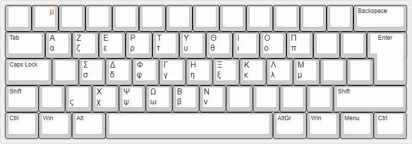

# frlatin9w

French latin9 keyboard layout for Windows

# Build

* Install [Microsoft Keyboard Layout Creator](https://www.microsoft.com/en-us/download/details.aspx?id=22339).
* File > Load Source File... > frlatin9w.klc
* Project > Build DLL and Setup Package

# Install

* Run `setup.exe`
* Start Menu > Settings > Time & language > Language > Français > Options
* Add `Français - latin9` and delete `Français`

# Layout

*Main layout*

*Acute*

*Grave*

*Diaeresis*

*Circumflex*

*Cedilla*

*Tilde*

*Ring*

*Greek alphabet*

Images from [https://github.com/ijprest/keyboard-layout-editor](https://github.com/ijprest/keyboard-layout-editor).
